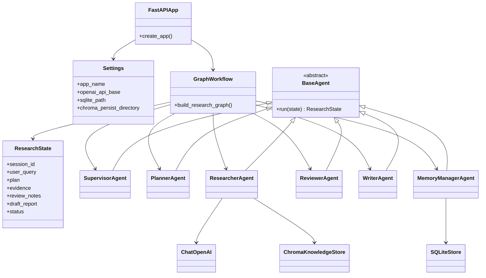
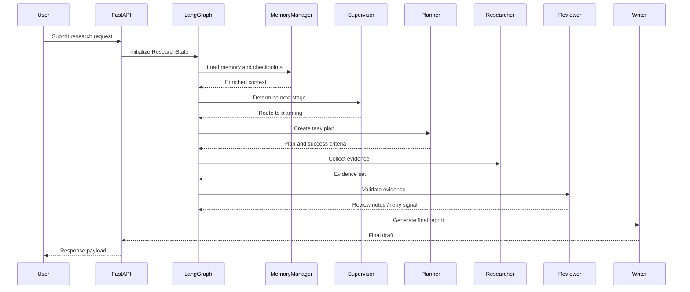

# UML

## Component Diagram

```mermaid
classDiagram
    class FastAPIApp {
        +create_app()
    }

    class Settings {
        +app_name
        +openai_api_base
        +sqlite_path
        +chroma_persist_directory
    }

    class ResearchState {
        +session_id
        +user_query
        +plan
        +evidence
        +review_notes
        +draft_report
        +status
    }

    class BaseAgent {
        <<abstract>>
        +run(state) ResearchState
    }

    class SupervisorAgent
    class PlannerAgent
    class ResearcherAgent
    class ReviewerAgent
    class WriterAgent
    class MemoryManagerAgent

    class GraphWorkflow {
        +build_research_graph()
    }

    class ChatOpenAI
    class SQLiteStore
    class ChromaKnowledgeStore

    FastAPIApp --> Settings
    FastAPIApp --> GraphWorkflow
    GraphWorkflow --> ResearchState
    GraphWorkflow --> SupervisorAgent
    GraphWorkflow --> PlannerAgent
    GraphWorkflow --> ResearcherAgent
    GraphWorkflow --> ReviewerAgent
    GraphWorkflow --> WriterAgent
    GraphWorkflow --> MemoryManagerAgent

    BaseAgent <|-- SupervisorAgent
    BaseAgent <|-- PlannerAgent
    BaseAgent <|-- ResearcherAgent
    BaseAgent <|-- ReviewerAgent
    BaseAgent <|-- WriterAgent
    BaseAgent <|-- MemoryManagerAgent

    ResearcherAgent --> ChatOpenAI
    MemoryManagerAgent --> SQLiteStore
    ResearcherAgent --> ChromaKnowledgeStore
```

## Sequence Diagram

```mermaid
sequenceDiagram
    participant User
    participant API as FastAPI
    participant Graph as LangGraph
    participant MM as MemoryManager
    participant S as Supervisor
    participant P as Planner
    participant R as Researcher
    participant V as Reviewer
    participant W as Writer

    User->>API: Submit research request
    API->>Graph: Initialize ResearchState
    Graph->>MM: Load memory and checkpoints
    MM-->>Graph: Enriched context
    Graph->>S: Determine next stage
    S-->>Graph: Route to planning
    Graph->>P: Create task plan
    P-->>Graph: Plan and success criteria
    Graph->>R: Collect evidence
    R-->>Graph: Evidence set
    Graph->>V: Validate evidence
    V-->>Graph: Review notes / retry signal
    Graph->>W: Generate final report
    W-->>API: Final draft
    API-->>User: Response payload
```
