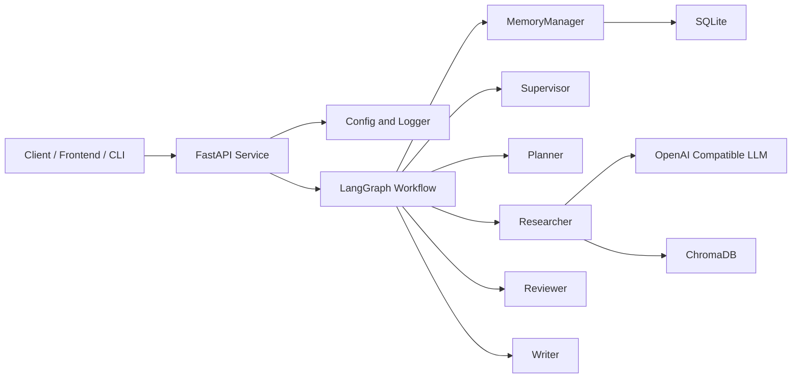
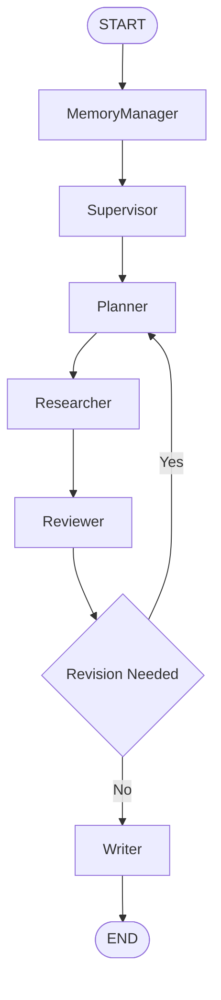
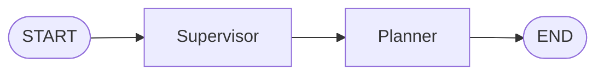
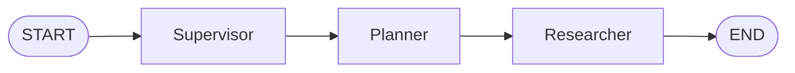
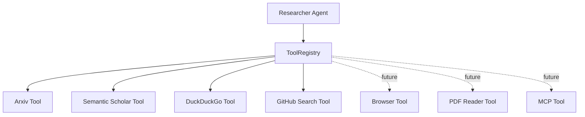

# AI Research Agent

Industrial-grade multi-agent research assistant built with **LangGraph**,
**LangChain**, **FastAPI**, and **OpenAI-compatible APIs**.

This repository is intentionally positioned as a **resume-quality engineering
project** rather than a toy demo. The first milestone does **not** implement the
full business workflow. Instead, it establishes a production-minded foundation:

- clear package boundaries
- extensible multi-agent orchestration design
- typed configuration and schema management
- deployment-friendly project structure
- architecture documentation with UML and workflow diagrams

## Project Introduction

`AI Research Agent` is designed as a multi-agent application that can turn a
user query into a structured research process:

1. understand the objective
2. plan the investigation
3. gather evidence
4. review information quality
5. synthesize the final response

The long-term target is a research system that supports:

- multi-step planning
- iterative retrieval and review
- memory-aware execution
- reproducible orchestration
- API-first integration

The current iteration focuses on the **engineering skeleton** required to build
that system correctly.

## Overall Architecture



Additional architecture documents:

- [overview.md](file:///e:/AI/study/agent/AI%20Research%20Agent/docs/architecture/overview.md)
- [uml.md](file:///e:/AI/study/agent/AI%20Research%20Agent/docs/architecture/uml.md)
- [workflow.md](file:///e:/AI/study/agent/AI%20Research%20Agent/docs/architecture/workflow.md)
- [agents.md](file:///e:/AI/study/agent/AI%20Research%20Agent/docs/architecture/agents.md)

## Agent Roles

### Supervisor

- orchestrates the graph lifecycle
- decides routing and retry policy
- applies execution guardrails

### Planner

- decomposes user intent into structured research tasks
- defines success criteria for downstream execution
- prepares the execution plan for the graph

### Researcher

- gathers evidence from tools, retrieval, and external knowledge sources
- structures findings into the shared state
- collaborates with memory and vector retrieval components

### Reviewer

- checks evidence quality and completeness
- identifies contradictions, weak support, and missing coverage
- decides whether the workflow should loop for more research

### Writer

- turns validated findings into a final answer
- controls response structure and final output quality
- supports future report templates and delivery formats

### MemoryManager

- manages short-term state hydration and persistence
- coordinates long-term memory and retrieval context
- supports resumable sessions and future checkpointing

## LangGraph Workflow



Current code keeps the graph implementation intentionally simple while the
documentation defines the target iterative workflow.

## Current Milestone Workflow

This round implements the first runnable orchestration slice:



The current workflow is intentionally bounded:

- `Supervisor` receives the user task and initializes the planning handoff
- `Planner` decomposes the task into multiple `ResearchTask` items
- no `Researcher` execution is implemented in this round

## Research Milestone Workflow

This round extends the runnable workflow to:



## Tech Stack

- Python 3.12
- LangGraph
- LangChain
- FastAPI
- Pydantic / Pydantic Settings
- uv
- Docker
- OpenAI Compatible API
- SQLite
- ChromaDB
- Structlog
- PyYAML

## Project Structure

```text
ai-research-agent/
├── configs/
│   ├── logging.yaml
│   └── settings.example.toml
├── docs/
│   └── architecture/
│       ├── agents.md
│       ├── overview.md
│       ├── uml.md
│       └── workflow.md
├── src/
│   └── ai_research_agent/
│       ├── agents/
│       │   ├── base.py
│       │   ├── memory_manager.py
│       │   ├── planner/
│       │   │   ├── agent.py
│       │   │   ├── prompt.py
│       │   │   └── state.py
│       │   ├── researcher/
│       │   │   ├── agent.py
│       │   │   ├── prompt.py
│       │   │   └── state.py
│       │   ├── reviewer.py
│       │   ├── supervisor/
│       │   │   ├── agent.py
│       │   │   ├── prompt.py
│       │   │   └── state.py
│       │   └── writer.py
│       ├── api/
│       │   └── routers/
│       │       └── system.py
│       ├── core/
│       │   ├── config.py
│       │   └── logging.py
│       ├── graph/
│       │   ├── state.py
│       │   └── workflow.py
│       ├── infra/
│       │   ├── llm/
│       │   │   └── client.py
│       │   ├── storage/
│       │   │   └── sqlite.py
│       │   └── vectorstore/
│       │       └── chroma.py
│       ├── schemas/
│       │   └── system.py
│       ├── tools/
│       │   ├── arxiv.py
│       │   ├── base.py
│       │   ├── duckduckgo.py
│       │   ├── github_search.py
│       │   ├── registry.py
│       │   └── semantic_scholar.py
│       └── app.py
├── tests/
│   ├── agents/
│   ├── tools/
│   └── graph/
├── .env.example
├── .gitignore
├── Dockerfile
├── pyproject.toml
└── requirements.txt
```

## Package Design

### `core`

Cross-cutting concerns such as configuration loading, environment parsing, and
logging bootstrap.

### `api`

FastAPI application composition, routes, and API-facing dependencies.

### `graph`

LangGraph state definitions and workflow construction logic.

### `agents`

Role-oriented agent implementations that operate on a shared graph state.

### `infra`

External service adapters, including LLM providers, SQLite persistence, and
ChromaDB-based retrieval.

### `schemas`

Typed request and response models used across API and application boundaries.

## Configuration Strategy

The project uses a layered configuration approach:

- `.env.example` for local environment variable contracts
- `configs/settings.example.toml` for readable deployment examples
- `src/ai_research_agent/core/config.py` for typed runtime settings
- `configs/logging.yaml` for centralized logger configuration

This setup keeps local development, containerization, and future cloud
deployment aligned.

## Logging Strategy

Logging is initialized from `configs/logging.yaml` and wrapped with
`structlog` so the project can evolve from local plain logs to structured JSON
logging for observability platforms.

## Supervisor Design

- `Supervisor` is the workflow entry node in the current implementation
- it normalizes whitespace in the incoming user task
- it writes `normalized_query` and `supervisor_notes` into shared state
- it transitions workflow status from `initialized` to `planning`
- it does not perform planning or research itself

## Planner Design

- `Planner` consumes the normalized task prepared by `Supervisor`
- it generates deterministic typed `ResearchTask` objects
- it writes both `tasks` and a string `plan` projection into shared state
- it marks the workflow as `researching` for the current milestone
- it hands structured tasks to `Researcher`

## Researcher Design

- `Researcher` consumes planned `ResearchTask` objects
- it automatically selects tools based on the task objective
- it normalizes returned results into typed `Evidence` items
- it stores tool invocation traces in `tool_calls`
- it leaves room for future Browser, PDF Reader, and MCP integration

## Tool Calling

- `Researcher` does not call tool implementations directly
- it delegates tool selection and execution to `ToolRegistry`
- each tool returns a normalized `ToolResult` structure
- current tool support includes `Arxiv`, `Semantic Scholar`, `DuckDuckGo`, and `GitHub Search`
- future extension slots are reserved for `Browser`, `PDF Reader`, and `MCP`

## Tool Architecture



## Local Development

### 1. Create environment

```bash
uv venv
```

### 2. Install dependencies

```bash
uv pip install -r requirements.txt
```

### 3. Configure environment

```bash
copy .env.example .env
```

### 4. Run the API

```bash
uvicorn ai_research_agent.app:create_app --factory --host 0.0.0.0 --port 8000 --app-dir src
```

After startup, visit:

- `http://localhost:8000/docs`
- `http://localhost:8000/api/v1/health`

## Project Running

Run the implemented workflow directly from Python:

```bash
python -c "from ai_research_agent.graph.workflow import run_research_workflow; result = run_research_workflow('Design an enterprise AI research plan'); print(result.model_dump_json(indent=2))" 
```

Run tests for the implemented milestone:

```bash
pytest -q
```

The current runnable scope is:

- API startup and health check
- `Supervisor` node execution
- `Planner` node execution
- `Researcher` node execution
- `START → Supervisor → Planner → Researcher → END` workflow invocation

## Docker

Build and run:

```bash
docker build -t ai-research-agent .
docker run --rm -p 8000:8000 --env-file .env ai-research-agent
```

## Why This Is Not A Demo

This repository is intentionally structured to look and behave like a real
application codebase:

- `src` layout for packaging discipline
- dedicated architecture documentation
- typed settings and logger bootstrap
- explicit orchestration layer
- clear infrastructure boundaries
- future-proof storage and retrieval placeholders

That makes it suitable for:

- resume presentation
- GitHub portfolio review
- iterative feature expansion
- system design discussion in interviews

## Example Input Output

Example input:

```text
Design an enterprise AI research plan for multi-agent systems
```

Example workflow output:

```json
{
  "session_id": "session-001",
  "user_query": "Design an enterprise AI research plan for multi-agent systems",
  "normalized_query": "Design an enterprise AI research plan for multi-agent systems",
  "supervisor_notes": [
    "Supervisor accepted the incoming task.",
    "Workflow routed to Planner."
  ],
  "tasks": [
    {
      "task_id": "task-1",
      "title": "Clarify Objective",
      "objective": "Define the scope and expected outcome for: Design an enterprise AI research plan for multi-agent systems",
      "rationale": "A clear objective prevents downstream ambiguity.",
      "status": "planned"
    }
  ],
  "plan": [
    "Define the scope and expected outcome for: Design an enterprise AI research plan for multi-agent systems"
  ],
  "planning_summary": "Planner created a deterministic three-step research backlog for the downstream Researcher.",
  "status": "completed"
}
```

The real runtime output currently contains three planned tasks. The example is
shortened here for readability.

## Researcher Usage Example

Run the research workflow:

```bash
python -c "from ai_research_agent.graph.workflow import run_research_workflow; result = run_research_workflow('Find papers and GitHub repositories for multi-agent research systems'); print(result.model_dump_json(indent=2))"
```

Example output fragment:

```json
{
  "tool_calls": [
    {
      "tool_name": "duckduckgo",
      "query": "Research benchmark papers and code implementations for multi-agent systems",
      "success": true,
      "result_count": 1
    }
  ],
  "evidence": [
    {
      "evidence_id": "task-1-duckduckgo-1",
      "task_id": "task-1",
      "source": "duckduckgo",
      "title": "DuckDuckGo web results for Research benchmark papers and code implementations for multi-agent systems",
      "snippet": "General web discovery result related to Research benchmark papers and code implementations for multi-agent systems.",
      "url": "https://duckduckgo.com/"
    }
  ]
}
```

## Future Development Plan

- implement research request and response schemas
- add graph conditional routing and retry loops
- integrate tool calling and web retrieval
- add SQLite checkpoint persistence
- add ChromaDB document ingestion and retrieval
- introduce prompt templates and output contracts
- add unit tests, integration tests, and CI
- add Docker Compose for local dependent services
- add authentication, rate limiting, and tracing
- expose streaming responses and async task execution

## License

MIT
