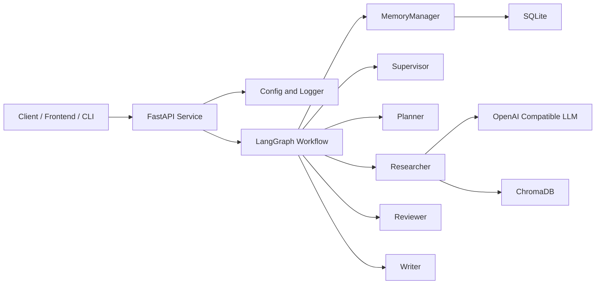
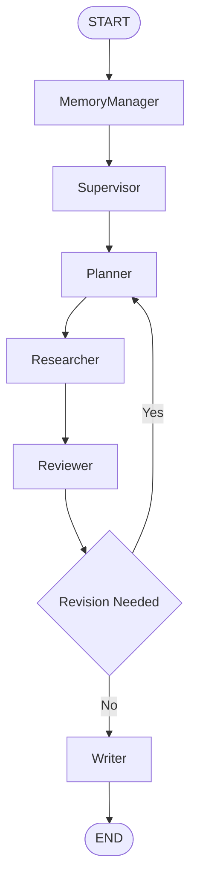
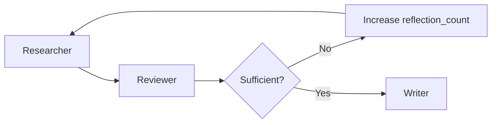
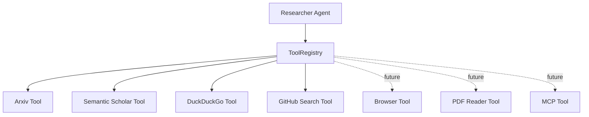

# AI 研究助手

基于 **LangGraph**、**LangChain**、**FastAPI** 和 **兼容 OpenAI 的 API** 构建的工业级多智能体研究助手。

## 项目简介

`AI Research Agent` 被设计为一个多智能体应用，能够将用户查询转化为结构化的研究流程：

1. 理解目标
2. 规划调研
3. 收集证据
4. 审查信息质量
5. 综合最终回答

长期目标是构建一个支持以下特性的研究系统：

- 多步规划
- 迭代检索与审查
- 具备记忆感知的执行
- 可复现的编排
- 优先 API 集成

当前迭代专注于构建上述系统所需的**工程骨架**。

## 整体架构



其他架构文档：

- [overview.md](file:///e:/AI/study/agent/AI%20Research%20Agent/docs/architecture/overview.md)
- [uml.md](file:///e:/AI/study/agent/AI%20Research%20Agent/docs/architecture/uml.md)
- [workflow.md](file:///e:/AI/study/agent/AI%20Research%20Agent/docs/architecture/workflow.md)
- [agents.md](file:///e:/AI/study/agent/AI%20Research%20Agent/docs/architecture/agents.md)

## 智能体角色

### 主管（Supervisor）

- 编排图生命周期
- 决定路由和重试策略
- 施加执行护栏

### 规划器（Planner）

- 将用户意图分解为结构化的研究任务
- 为下游执行定义成功标准
- 为图准备执行计划

### 研究员（Researcher）

- 从工具、检索和外部知识源收集证据
- 将研究发现整理到共享状态中
- 与记忆和向量检索组件协作

### 审查员（Reviewer）

- 检查证据质量和完整性
- 识别矛盾、证据薄弱和覆盖缺失
- 决定工作流是否应循环以进行更多研究

### 写作者（Writer）

- 将经过验证的研究结果转化为最终答案
- 控制回答结构和最终输出质量
- 支持未来的报告模板和交付格式

### 记忆管理器（MemoryManager）

- 管理短期状态的水合与持久化
- 协调长期记忆和检索上下文
- 支持可恢复会话和未来的检查点

## LangGraph 工作流



当前代码保持图实现刻意简单，而文档定义了目标的迭代工作流。

## 当前里程碑工作流

本轮实现第一个可运行的编排切片：


当前工作流有意限定范围：

- `Supervisor` 接收用户任务并初始化规划交接
- `Planner` 将任务分解为多个 `ResearchTask` 项
- 本轮未实现 `Researcher` 执行

## 研究里程碑工作流

本轮将可运行工作流扩展为：


## 技术栈

- Python 3.12
- LangGraph
- LangChain
- FastAPI
- Pydantic / Pydantic Settings
- uv
- Docker
- 兼容 OpenAI 的 API
- SQLite
- ChromaDB
- Structlog
- PyYAML

## 项目结构

```text
ai-research-agent/
├── configs/
│   ├── logging.yaml
│   └── settings.example.toml
├── docs/
│   └── architecture/
│       ├── agents.md
│       ├── overview.md
│       ├── uml.md
│       └── workflow.md
├── src/
│   └── ai_research_agent/
│       ├── agents/
│       │   ├── base.py
│       │   ├── memory_manager.py
│       │   ├── planner/
│       │   │   ├── agent.py
│       │   │   ├── prompt.py
│       │   │   └── state.py
│       │   ├── researcher/
│       │   │   ├── agent.py
│       │   │   ├── prompt.py
│       │   │   └── state.py
│       │   ├── reviewer/
│       │   │   ├── agent.py
│       │   │   ├── prompt.py
│       │   │   └── state.py
│       │   ├── supervisor/
│       │   │   ├── agent.py
│       │   │   ├── prompt.py
│       │   │   └── state.py
│       │   └── writer/
│       │       ├── agent.py
│       │       ├── prompt.py
│       │       └── state.py
│       ├── api/
│       │   └── routers/
│       │       └── system.py
│       ├── core/
│       │   ├── config.py
│       │   └── logging.py
│       ├── graph/
│       │   ├── state.py
│       │   └── workflow.py
│       ├── infra/
│       │   ├── llm/
│       │   │   └── client.py
│       │   ├── storage/
│       │   │   └── sqlite.py
│       │   └── vectorstore/
│       │       └── chroma.py
│       ├── schemas/
│       │   └── system.py
│       ├── tools/
│       │   ├── arxiv.py
│       │   ├── base.py
│       │   ├── duckduckgo.py
│       │   ├── github_search.py
│       │   ├── registry.py
│       │   └── semantic_scholar.py
│       └── app.py
├── tests/
│   ├── agents/
│   ├── tools/
│   └── graph/
├── .env.example
├── .gitignore
├── Dockerfile
├── pyproject.toml
└── requirements.txt
```

## 包设计

### `core`

横切关注点，如配置加载、环境解析和日志引导。

### `api`

FastAPI 应用组合、路由和面向 API 的依赖项。

### `graph`

LangGraph 状态定义和工作流构建逻辑。

### `agents`

面向角色的智能体实现，操作于共享图状态。

### `infra`

外部服务适配器，包括 LLM 提供方、SQLite 持久化和基于 ChromaDB 的检索。

### `schemas`

用于 API 和应用边界之间的类型化请求与响应模型。

## 配置策略

项目采用分层配置方式：

- `.env.example` 为本地环境变量契约
- `configs/settings.example.toml` 提供可读的部署示例
- `src/ai_research_agent/core/config.py` 提供类型化的运行时设置
- `configs/logging.yaml` 集中化日志配置

这种设置使本地开发、容器化和未来云部署保持一致。

## 日志策略

日志从 `configs/logging.yaml` 初始化，并通过 `structlog` 包装，使项目能够从本地纯文本日志演进为面向可观测性平台的 JSON 结构化日志。

## 主管设计

- `Supervisor` 是当前实现中的工作流入口节点
- 它对传入的用户任务进行空白字符规范化
- 它将 `normalized_query` 和 `supervisor_notes` 写入共享状态
- 它将工作流状态从 `initialized` 转换为 `planning`
- 它自身不执行规划或研究

## 规划器设计

- `Planner` 消费由 `Supervisor` 规范化的任务
- 它生成确定性的类型化 `ResearchTask` 对象
- 它将 `tasks` 和字符串形式的 `plan` 投影写入共享状态
- 它在当前里程碑中将工作流标记为 `researching`
- 它将结构化任务交接给 `Researcher`

## 研究员设计

- `Researcher` 消费已规划的 `ResearchTask` 对象
- 它根据任务目标自动选择工具
- 它将返回结果规范化为类型化的 `Evidence` 项
- 它将工具调用轨迹存储在 `tool_calls` 中
- 它为未来的浏览器、PDF 阅读器和 MCP 集成预留了空间

## 反思机制

- `Reviewer` 在每次 `Researcher` 执行后检查证据充分性
- 工作流将每次审查决策记录在 `reflection_history` 中
- `reasoning_log` 存储分步路由和审查推理
- `transition_history` 保持工作流路径可追溯
- `latest_feedback` 在重试时回传给 `Researcher`

## 审查工作流



## 重试策略

- 重试次数由 `research_max_iterations` 限制
- 当证据数量或来源多样性过低时，`Reviewer` 请求重试
- `Researcher` 在收到审查反馈后扩大工具查询范围
- 一旦达到重试上限，`Reviewer` 批准当前证据集
- 每次重试都会持久化到 `reflection_count` 和 `reflection_history` 中

## 智能体协作流程

- `Supervisor` 规范化并接收传入任务
- `Planner` 将目标分解为 `ResearchTask` 项
- `Researcher` 收集证据和工具轨迹
- `Reviewer` 决定是重试还是继续
- `Writer` 生成当前里程碑的报告草稿

## 工具调用

- `Researcher` 不直接调用工具实现
- 它通过 `ToolRegistry` 委托工具选择和执行
- 每个工具返回规范化的 `ToolResult` 结构
- 当前支持的工具包括 `Arxiv`、`Semantic Scholar`、`DuckDuckGo` 和 `GitHub Search`
- 预留了 `Browser`、`PDF Reader` 和 `MCP` 的未来扩展槽

## 工具架构



## 本地开发

### 1. 创建环境

```bash
uv venv
```

### 2. 安装依赖

```bash
uv pip install -r requirements.txt
```

### 3. 配置环境

```bash
copy .env.example .env
```

### 4. 运行 API

```bash
uvicorn ai_research_agent.app:create_app --factory --host 0.0.0.0 --port 8000 --app-dir src
```

启动后，访问：

- `http://localhost:8000/docs`
- `http://localhost:8000/api/v1/health`

## 项目运行

直接从 Python 运行已实现的工作流：

```bash
python -c "from ai_research_agent.graph.workflow import run_research_workflow; result = run_research_workflow('Design an enterprise AI research plan'); print(result.model_dump_json(indent=2))" 
```

运行已实现里程碑的测试：

```bash
pytest -q
```

当前可运行范围包括：

- API 启动和健康检查
- `Supervisor` 节点执行
- `Planner` 节点执行
- `Researcher` 节点执行
- `Reviewer` 节点执行
- `Writer` 节点执行
- `START → Supervisor → Planner → Researcher ↔ Reviewer → Writer → END` 工作流调用

## Docker

构建并运行：

```bash
docker build -t ai-research-agent .
docker run --rm -p 8000:8000 --env-file .env ai-research-agent
```

## 示例输入输出

示例输入：

```text
Design an enterprise AI research plan for multi-agent systems
```

示例工作流输出：

```json
{
  "session_id": "session-001",
  "user_query": "Design an enterprise AI research plan for multi-agent systems",
  "normalized_query": "Design an enterprise AI research plan for multi-agent systems",
  "supervisor_notes": [
    "Supervisor accepted the incoming task.",
    "Workflow routed to Planner."
  ],
  "tasks": [
    {
      "task_id": "task-1",
      "title": "Clarify Objective",
      "objective": "Define the scope and expected outcome for: Design an enterprise AI research plan for multi-agent systems",
      "rationale": "A clear objective prevents downstream ambiguity.",
      "status": "planned"
    }
  ],
  "plan": [
    "Define the scope and expected outcome for: Design an enterprise AI research plan for multi-agent systems"
  ],
  "planning_summary": "Planner created a deterministic three-step research backlog for the downstream Researcher.",
  "status": "completed"
}
```

实际运行时输出包含三个计划任务，为便于阅读，此处示例做了简化。

## 研究员使用示例

运行研究工作流：

```bash
python -c "from ai_research_agent.graph.workflow import run_research_workflow; result = run_research_workflow('Find papers and GitHub repositories for multi-agent research systems'); print(result.model_dump_json(indent=2))"
```

示例输出片段：

```json
{
  "tool_calls": [
    {
      "tool_name": "duckduckgo",
      "query": "Research benchmark papers and code implementations for multi-agent systems",
      "success": true,
      "result_count": 1
    }
  ],
  "evidence": [
    {
      "evidence_id": "task-1-duckduckgo-1",
      "task_id": "task-1",
      "source": "duckduckgo",
      "title": "DuckDuckGo web results for Research benchmark papers and code implementations for multi-agent systems",
      "snippet": "General web discovery result related to Research benchmark papers and code implementations for multi-agent systems.",
      "url": "https://duckduckgo.com/"
    }
  ]
}
```

## 反思使用示例

```bash
python -c "from ai_research_agent.graph.workflow import run_research_workflow; result = run_research_workflow('Analyze enterprise multi-agent orchestration patterns'); print(result.reflection_count); print(result.review_decision); print(result.transition_history)"
```

## 未来开发计划

- 实现研究请求和响应模式
- 增加图条件路由和重试循环
- 集成工具调用和网络检索
- 增加 SQLite 检查点持久化
- 增加 ChromaDB 文档摄取和检索
- 引入提示模板和输出契约
- 增加单元测试、集成测试和 CI
- 增加 Docker Compose 以支持本地依赖服务
- 增加认证、速率限制和链路追踪
- 支持流式响应和异步任务执行

## 许可证

MIT
