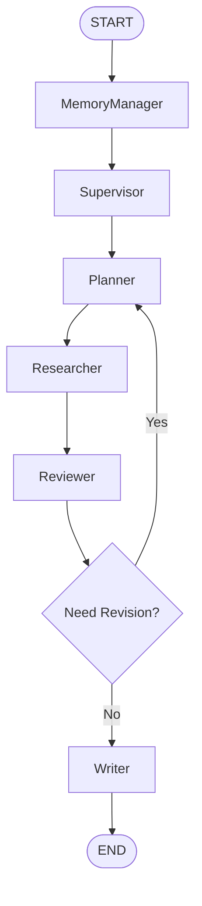

# LangGraph Workflow

## Graph Topology

## Node Responsibilities

- `MemoryManager`: load prior context, checkpoints, and retrieval hints
- `Supervisor`: apply policy, determine next node, control retries and failure exits
- `Planner`: translate user intent into bounded subtasks and acceptance criteria
- `Researcher`: gather evidence from tools, web, memory, and vector retrieval
- `Reviewer`: score evidence quality and decide whether another research loop is needed
- `Writer`: synthesize reviewed evidence into a report or actionable answer

## Workflow Notes

- The first milestone keeps the graph linear in code for simplicity.
- The documented target workflow includes a review loop from `Reviewer` to `Planner`.
- Retry budgeting should eventually be controlled by `research_max_iterations`.
- Timeout and cancellation logic should be enforced by the `Supervisor`.
